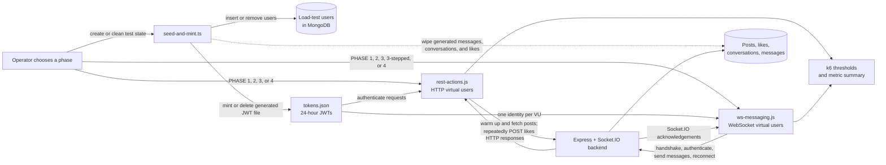

# Load testing

This directory contains separate k6 suites for realtime messages and ordinary HTTP writes. Run them separately so their results identify the affected path.

Historical results are in [frontend/load_testing_plan.md](../../frontend/load_testing_plan.md).

## How the ensemble works

The load-testing ensemble has three parts: a data-and-token generator, an HTTP workload, and a WebSocket workload. It sends traffic directly to the backend; it does not drive the browser or measure frontend rendering.



The preparation script inserts synthetic users directly into MongoDB and signs a backend JWT for each user. The two k6 suites then reuse that identity pool:

- The HTTP suite warms the backend, fetches real post ids, and has each VU repeatedly like a randomly selected post with a randomly selected user token. It waits 1-3 seconds between requests and separates successful requests, latency, rate limits, connection-level failures, application `5xx` responses, and other `4xx` responses.
- The WebSocket suite assigns VU _n_ to token _n_ and pairs adjacent users (`0` with `1`, `2` with `3`, and so on). Each VU performs the Engine.IO/Socket.IO handshake over a plain k6 WebSocket, authenticates with its JWT, answers heartbeat pings, sends `message:send` events every 2-6 seconds by default, and matches acknowledgements by id. By default, each connection also has a 5% chance of an intentional reconnect every 45 seconds. It records connection and acknowledgement latency as well as timeouts, abandoned acknowledgements, unexpected disconnects, and connection errors.

Both suites validate that the token pool is large enough for the requested peak concurrency before generating load. They deliberately run separately, so a result can be attributed to the HTTP-like path or the realtime-message path. Neither suite is a full user-journey test: the HTTP workload currently covers likes only, while the WebSocket workload covers message sends, acknowledgements, and reconnect behavior rather than every messaging feature.

| Phase       | Shape                                         | Purpose                                                                                  |
| ----------- | --------------------------------------------- | ---------------------------------------------------------------------------------------- |
| 1           | One iteration / connection                    | Prove authentication, test data, routing, and acknowledgements work before a larger run. |
| 2           | Ramp through 10, 50, 100, 250, and 500 VUs    | Observe how latency and errors change as concurrency rises.                              |
| 3           | Hold `SUSTAINED_VUS` for `SUSTAINED_DURATION` | Check stability, resource growth, and error rates under sustained load.                  |
| `3-stepped` | WebSocket-only holds at 100, 150, and 200 VUs | Compare several sustained WebSocket levels in one run.                                   |
| 4           | Ramp to `PHASE4_MAX_VUS` and hold             | Push beyond the expected ceiling and document the failure mode.                          |

## Requirements

1. Install k6 version 2.2.0 or newer.
2. Start MongoDB and the backend.
3. Seed a few posts with `npm run seed` from `backend` before running the HTTP suite.
4. Create load test users and tokens with `npm run loadtest:seed -- --count=500` from `backend`.
5. Run phase 1 before every larger run.
6. Remove generated data afterward with `npm run loadtest:seed:wipe` from `backend`.

The seed command writes `load-test/tokens.json`. Each entry contains `userId`, `email`, and `token`. Tokens expire after 24 hours. The file is ignored by Git.

Use an even user count for the WebSocket suite. Phase 1 needs 2 users. Phase 2 needs 500. Phase 3 needs at least `SUSTAINED_VUS`. Phase `3-stepped` needs 200. Phase 4 needs at least `PHASE4_MAX_VUS`. Both suites' `setup()` reject a pool smaller than the phase's peak VU count.

## WebSocket suite

`ws-messaging.js` connects users in fixed pairs, sends messages, records acknowledgements, and occasionally reconnects a client.

The backend speaks Socket.IO rather than plain WebSocket. k6 provides a plain WebSocket client, so the script implements the required Engine.IO and Socket.IO frames. It connects to `/socket.io/?EIO=4&transport=websocket`, waits for the Engine.IO open packet, sends a Socket.IO connect packet containing the JWT, answers Engine.IO ping packets, and matches Socket.IO acknowledgement ids to sent messages.

Socket.IO packets used by the script are `40` for connect, `42` for an event, and `43` for an acknowledgement. Engine.IO ping `2` receives pong `3`.

The script compares `readyState` with numeric value `1`. The k6 build used for the recorded runs did not expose `WebSocket.OPEN`, which caused an earlier version of the test to connect without sending messages.

Run from `load-test/k6`:

```bash
k6 run -e PHASE=1 ws-messaging.js
k6 run -e PHASE=2 ws-messaging.js
k6 run -e PHASE=3 -e SUSTAINED_VUS=100 -e SUSTAINED_DURATION=12m ws-messaging.js
k6 run -e PHASE=3-stepped ws-messaging.js
k6 run -e PHASE=4 -e PHASE4_MAX_VUS=750 ws-messaging.js
```

Phase 1 connects one sender, sends one message, verifies the acknowledgement, and prints a result. Phase 2 ramps through 10, 50, 100, 250, and 500 virtual users. Phase 3 holds a configured number of users. Phase `3-stepped` holds 100, 150, and 200 users in sequence. Phase 4 continues to a configurable ceiling.

Common settings are `BASE_URL`, `TOKENS_FILE`, `WARMUP_PATH`, `MSG_MIN_INTERVAL_S`, `MSG_MAX_INTERVAL_S`, `ACK_TIMEOUT_MS`, `CONNECT_TIMEOUT_MS`, `RECONNECT_PROBABILITY`, `RECONNECT_CHECK_INTERVAL_S`, `SUSTAINED_VUS`, `SUSTAINED_DURATION`, `PHASE4_MAX_VUS`, `STEPPED_RAMP_DURATION`, and `STEPPED_HOLD_DURATION`.

The default backend address is `http://localhost:3001`. The default token path is `../tokens.json`, resolved relative to the script.

Watch `ws_connect_latency`, `ws_message_ack_latency`, `ws_ack_failure_rate`, `ws_messages_sent`, `ws_acks_received`, `ws_ack_timeouts`, `ws_acks_abandoned`, `ws_unexpected_disconnects`, and `ws_connection_errors`.

A VU whose Socket.IO handshake never completes (no CONNECT ack, no CONNECT_ERROR — a silently stalled connection) is closed after `CONNECT_TIMEOUT_MS` (default 10s) and counted in `ws_connection_errors`, instead of sitting idle for the rest of the scenario with no failure signal.

## HTTP suite

`rest-actions.js` repeatedly calls `POST /api/post/like` with real user tokens and post ids. It obtains the post pool from `GET /api/post` during setup.

The HTTP rate limiters use source IP by default. All k6 users normally share one IP, so phases 2 through 4 would measure the limiter instead of backend capacity. For local capacity tests, start the backend with `LOAD_TEST_DISABLE_RATE_LIMITS=true`. This setting is ignored when `NODE_ENV` is `production`.

Run from the repository root:

```bash
k6 run -e PHASE=1 load-test/k6/rest-actions.js
k6 run -e PHASE=2 load-test/k6/rest-actions.js
k6 run -e PHASE=3 -e SUSTAINED_VUS=100 -e SUSTAINED_DURATION=12m load-test/k6/rest-actions.js
k6 run -e PHASE=4 -e PHASE4_MAX_VUS=750 -e PHASE4_HOLD_DURATION=3m load-test/k6/rest-actions.js
```

Common settings are `BASE_URL`, `TOKENS_FILE`, `PHASE`, `POST_POOL_LIMIT`, `SUSTAINED_VUS`, `SUSTAINED_DURATION`, `PHASE4_MAX_VUS`, and `PHASE4_HOLD_DURATION`. `setup()` also rejects a token pool smaller than the phase's peak VU count (1 / 500 / `SUSTAINED_VUS` / `PHASE4_MAX_VUS` for phases 1-4) — each iteration picks a random token from the whole pool, so an undersized pool means a handful of accounts absorb all the write load instead of the concurrency the phase is meant to test.

Watch `like_success_rate`, `like_latency_ms`, `like_rate_limited_429`, `like_infra_timeouts`, `like_app_5xx_errors`, and `like_other_client_errors_4xx`.

A `429` response means the application rate limiter handled the request. Status `0` (no response at all — connection reset, timeout) is tracked as `like_infra_timeouts`, the closest thing to a platform-level signal. A `5xx` response is tracked separately as `like_app_5xx_errors` — `post-controller.ts` returns `500` for ordinary caught application errors (e.g. "Database not connected"), not just genuine infra failures, so a `5xx` with a JSON body is the app responding, not the platform failing to. Other `4xx` responses usually indicate invalid test data or expired authentication.

## Reading results

Do not treat aggregate phase metrics as a precise capacity boundary. A ramping scenario combines every stage in one summary unless output is sent to a time series system. Record backend CPU, memory, database behavior, and the exact environment beside the k6 summary.

The recorded local runs show a large difference between MongoDB Atlas free tier and local MongoDB. See the [load test results](../../frontend/load_testing_plan.md) before comparing a new run.
